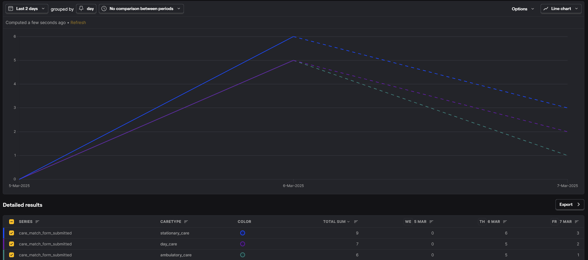
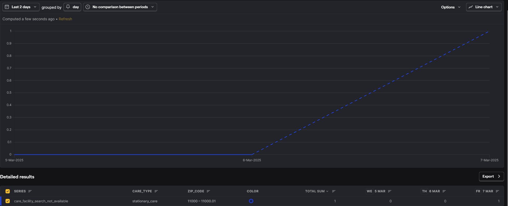

# CarePortal Beta

CarePortal Beta allows users to search Care Facilities based on the care type they need, near their zipcode

## Running the project

CarePortal Beta consists of two deployments:
- [Backend](./backend/README.md), built with FastAPI
- [Frontend](./frontend/README.md), built with NextJS

Inside each are instructions on running them locally.

## Deployment
For ease of deployment, the Backend has been deployed to a VPS with [Coolify](https://coolify.io/), while the frontend has been deployed on Vercel

## Features
- Care Facilities database, allowing for quickly onboarding new care facilities to CarePortal
- Search Portal where users can look for care facilities for a given care type and zip code
- Contact Request Form, for users interested in getting in contact with a Care Facility
- Analytics, allowing us to understand users usage patterns and needs

## Next Steps
- Notify a Care Facility when a user is requesting information
- Add proper Learn More, etc pages
- Iterate based on insights from analytics

## Analytics Capabilities
By measuring the following events, we can get to understand how users use CarePortal, as well as what kind of facilities they are searching for.
### Backend Events
- **care_facility_search_not_found**: triggered when a search has no results. May provide insights into which zip codes lack coverage
- **care_facility_search_not_available**: triggerd when a search has results, but none of the facilities have any availability for new patients. May provide insights into which facilities could benefit from increasing capacity
- **care_facility_search_found**: triggered when a search has results, and at least one facility has availability. May provide insights for well-covered zip codes and facilities

### Frontend Events
- **care_match_form_step_completed**: triggered when a step in the contact form has been completed. Could help detect usage patterns, and potential user retention loss in specific steps in the funnel
- **care_match_form_submitted**: triggered when the search form is submitted. May provide insights into the _global_ searches, wether or not there were results
- **contact_form_opened**: triggered when a contact form is opened. May help gauge actual and user intent in a given facility, care type, and zip code
- **contact_form_submitted**: triggered when a contact form is submitted. May help gauge actual and user intent in a given facility, care type, and zip code

### Example Analytics
Here's an example of the analytics we can gather from the `care_match_form_submitted` event:

This chart shows the number of form submissions over time, helping us understand:
- Peak usage periods
- Day-over-day growth in platform adoption
- Which days of the week see the most activity
- The overall trend in user engagement
- Which care types user's seem to be most interested in

Here's an example of the analytics we can gather from the `care_facility_search_not_available` event:

This chart shows the number of form searches where the results showed existing facilities, but none with availability, helping us understand:
- Care Type and ZipCode combinations where an increase in capacity for the existing facilities, or new facilities, would be beneficial

